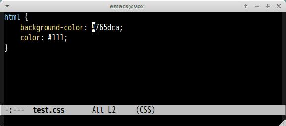

# hex-to-rgba.el

Emacs port of [Hex-to-RGBA](https://github.com/aroscoe/Hex-to-RGBA) which is Sublime Text plugin.

## Screencast

## Command

#### `M-x hex-to-rgba`

Convert color hex to rgba representation.
